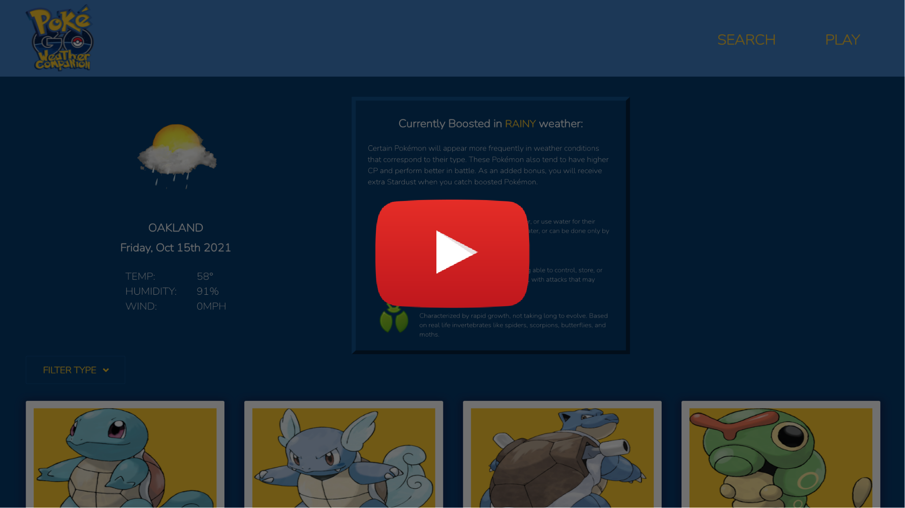

# PokeGo! Weather Companion

🐛 🐛 🐛 🐛

<br />

## Table of Contents

- [Description](#description)
- [User Story](#user-story)
- [Demo](#demo)
- [Deployment](#deployment)
- [License](#license)
- [Criteria](#criteria)
- [Collaboration](#collaboration)

<br />

## Description

Using both the [OpenWeather One Call API](https://openweathermap.org/api/one-call-api) & The [Pokemon Go Stats / Type API](https://pokemon-go1.p.rapidapi.com), PokeGo Weather Companion will collect a users' valid city input, provide today's weather along with a list of Pokemone currently boosted in current conditions.

<br />
<br />

## User Story

```
AS A Pokemon Go player
I WANT to see what Pokemon are going to be outside
DEPENDING on the weather
SO I CAN earn maximum XP
```

<br />
<br />

## Demo

[](https://www.youtube.com/watch?v=ekhXjlZhRxU&ab_channel=DavidDyer)


<br />
<br />

## Deployment

**Visit PokeGo! Weather Companion on GitHub Pages:**

[](https://djdyer.github.io/pokego-weather-companion/)

<br />

**Employing the following technology:**

[](https://opensource.org/licenses/ISC)

<br />
<br />

## License

All Rights Reserved

<br />
<br />

## Criteria

```
Interactive application relying on valid user input

Presents animated gif of current weather condition

Displays temperature in degrees fahrenheit, humidity percentage, & wind speed

Displays boosted types detail with header, icons, & descriptions

Displays scrollable search results of Pokemon matching current boosted type

Card detail includes character image, type icon(s), name, & dynamic stats

Filter button drops down, allowing filter by any single currently boosted type

Persists most recent search result in local storage

Utilize the Bulma CSS framework

Polished and playful UI

Responsive for both desktop and mobile

Deployed
```

<br />
<br />

## Collaboration

<br />

Jacklyn Malone

<a href= "https://github.com/Jax-o"></a>

<br />

Eric Mellin

<a href= "https://github.com/VsAnomons1"></a>

<br />

Kevin Elmore

<a href= "https://github.com/kge123"></a>

<br />
<br />
Gotta catch em all!

🪲
